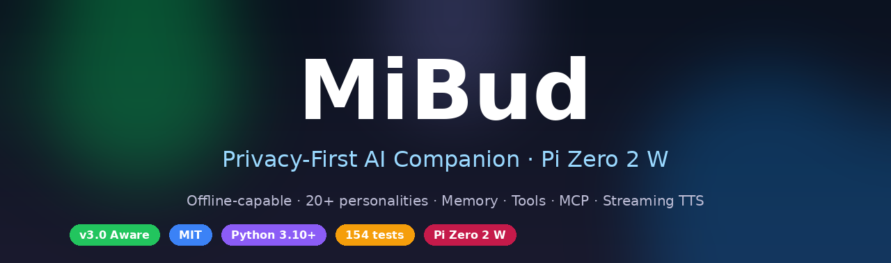
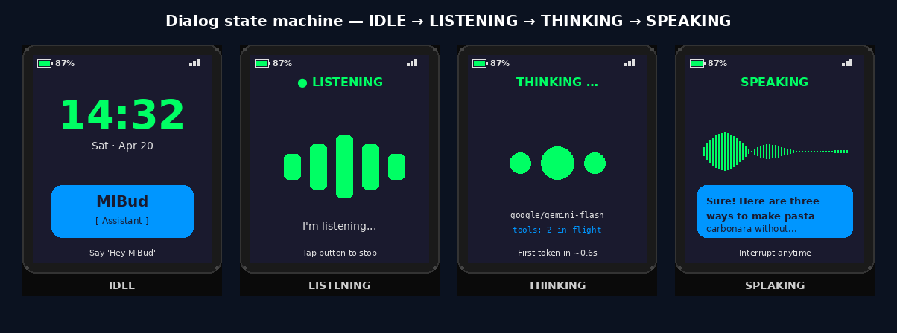
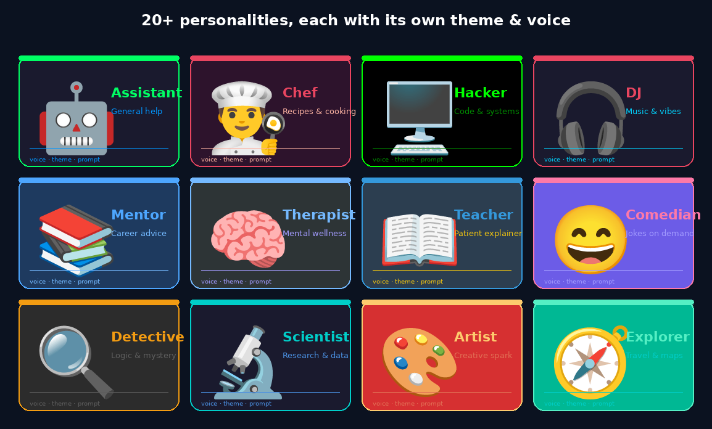
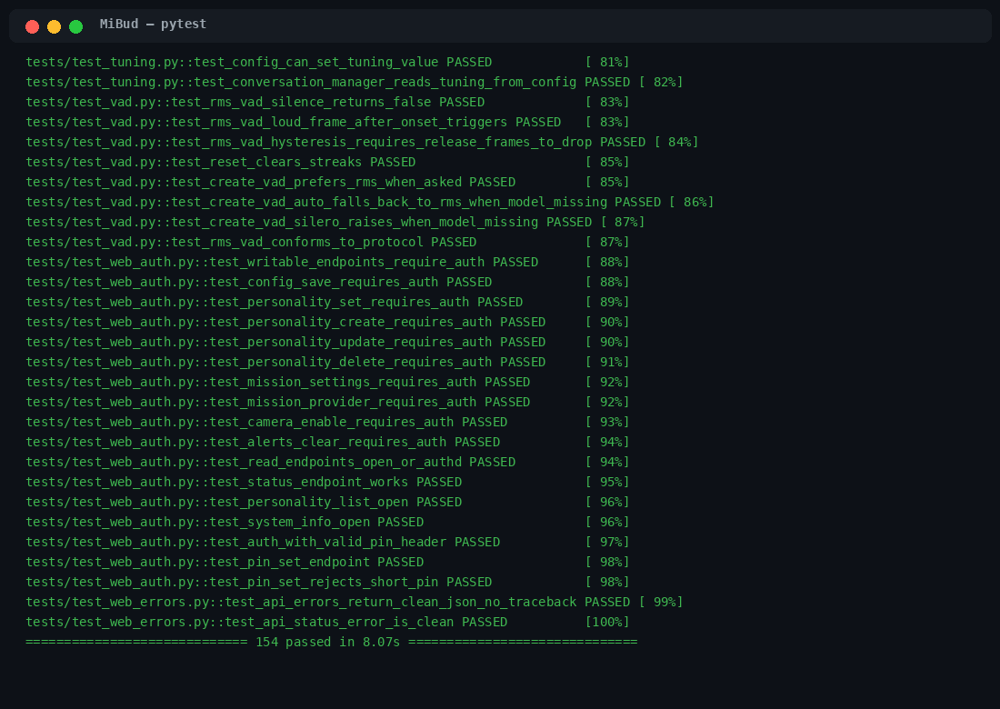

<div align="center">



<p>
  <a href="https://github.com/NaustudentX18/MiBud/actions/workflows/ci.yml"></a>
  <a href="https://github.com/NaustudentX18/MiBud/releases"></a>
  
  
  
  
  
</p>

<p><b>Pocket-sized. Always with you. Yours.</b></p>

<p>
  <a href="#-quick-start">Quick start</a> ·
  <a href="#-whats-new-in-v30-aware">What's new</a> ·
  <a href="#-personalities">Personalities</a> ·
  <a href="#%EF%B8%8F-architecture">Architecture</a> ·
  <a href="#-web-api">API</a> ·
  <a href="#-packages">Packages</a> ·
  <a href="#%EF%B8%8F-roadmap">Roadmap</a>
</p>

</div>

---

## ✨ Why MiBud?

> **Tiny device. Big personality. Zero compromise on privacy.**

MiBud is a friendly AI companion that fits in your pocket. It runs **fully offline**
on a Raspberry Pi Zero 2 W with the WhisPlay HAT and a PiSugar 3 battery — and
falls back to your favourite cloud LLM only when you ask it to. Twenty-plus
personalities, long-term memory, real tool use, MCP, plugins, streaming TTS,
barge-in, continuous dialog. All on 512 MB of RAM.

|     |     |
| --- | --- |
| 🔒 **Privacy-first** | 100 % offline mode — conversations never leave the device |
| 🧠 **20+ personalities** | Chef · Therapist · DJ · Hacker · Teacher · Detective … |
| 🔋 **8–10 h battery** | Power-aware ECO/BALANCED/PERFORMANCE profiles |
| ⚡ **First word in <1 s** | Streaming sentence TTS — speaks while the LLM thinks |
| 🌐 **Multi-provider** | OpenAI · Anthropic · Google · DeepSeek · OpenRouter · Ollama |
| 🎙️ **Real VAD** | Optional Silero ONNX (~2 MB) with RMS fallback |
| 🔌 **MCP + plugins** | Drop-in Python tools and external MCP servers |
| 💾 **One-shot backup** | Atomic tar.gz of config, memory DB, plugins, personalities |

---

## 🎬 See it in action

<div align="center">



<sub>The four states of every turn: idle clock, live mic with VAD bars, model + tool inflight indicator, streaming response with barge-in hint.</sub>

</div>

---

## 🎭 Personalities

<div align="center">



</div>

Switch personalities live from the dashboard, the API, or by voice
(`"MiBud, switch to Chef"`). Each one ships with its own:

- **Theme** — display colours, accent, secondary
- **Voice** — speed, pitch, style hint passed to TTS
- **System prompt** — tuned for that personality's domain
- **Capabilities** — which built-in tools are surfaced

Build your own from the web UI in under a minute, or drop a JSON file in
`config/profiles/` for full control.

---

## ✅ Tested. End-to-end.

<div align="center">



<sub><b>154 tests</b> covering memory, tools, streaming, dialog, MCP, plugins, backup, VAD, web auth, errors. Run locally with <code>pytest</code> in ~8 s; CI runs the same suite on every PR.</sub>

</div>

---

## 🚀 Quick start

### The fastest path — pre-built bundle

```bash
# On the Pi
wget https://github.com/NaustudentX18/MiBud/releases/download/v3.0.0/mibud-3.0.0-bundle.tar.gz
tar xzf mibud-3.0.0-bundle.tar.gz
cd mibud-3.0.0
sudo ./install.sh                 # apt deps → venv → wheel → systemd
```

Open **`http://mibud.local:5000`** and the setup wizard takes it from there.

### From source (any platform)

```bash
git clone https://github.com/NaustudentX18/MiBud.git
cd MiBud
pip install -e ".[full,dev]"     # cloud + offline + vad + dev extras
mibud                             # or: python -m core.main
```

### Just kick the tyres

```bash
python demo.py                    # mocked hardware, real personality + AI flow
```

---

## 🆕 What's new in v3.0 *Aware*

v3 focuses on the three things v2 didn't fully deliver — **natural conversation**,
a real **extensibility** story, and field-ready **resilience**.

| Area | What changed |
| --- | --- |
| 🗣️ **Barge-in** | Cancel a reply mid-sentence — the mic re-opens immediately, no wake word needed |
| 🔁 **Continuous dialog** | Mic stays open for a tunable window after each turn |
| 🔌 **MCP client** | Spawn any stdio MCP server; tools auto-register namespaced (`mcp_<server>_<tool>`) |
| 🧩 **Plugin loader** | Drop a `.py` in `plugins/` with `@tool` — isolated import, hot-reload via API |
| 💾 **Backup / restore** | Atomic tar.gz of config + SQLite memory snapshot + plugins; tarslip-safe restore |
| 🎙️ **Silero VAD** | Optional 2 MB ONNX model when present, hysteretic RMS detector otherwise |
| 📜 **Conversation trace** | JSONL per-turn log with rotation + ring buffer; surfaced via `/api/v3/trace` |
| ⚙️ **Config v3** | Auto-migrates v1 → v2 → v3; new feature flags for every v3 subsystem |

See the full [CHANGELOG](CHANGELOG.md).

---

## 🧠 v2.0 still here

Long-term memory, tool use, streaming TTS, power profiles, proactive engine,
hardened router with circuit breakers, and the SSE chat API all carried over —
just better integrated with the dialog/trace layers.

---

## 🧩 Hardware target

| Component | Model |
|-----------|-------|
| 🖥️ SBC | Raspberry Pi Zero 2 W |
| 🎧 AI HAT | Whisplay AI HAT (ST7789 240×280 + WM8960) |
| 🔋 Battery | PiSugar 3 (1200 mAh, I²C) |
| 📷 Camera | Picamera2 / USB (optional) |

Full pin map and driver setup in [`docs/HARDWARE.md`](docs/HARDWARE.md).

---

## 🏗️ Architecture

```
                      ┌────────────────────────────────────┐
                      │           DialogSession            │
                      │  IDLE → LISTENING → THINKING       │
                      │           ↑           ↓            │
                      │           └─ SPEAKING ─┘ barge-in  │
                      └─────────────┬──────────────────────┘
                                    │
       ┌────────────────────────────┼────────────────────────────┐
       ▼                            ▼                            ▼
  ┌──────────┐               ┌─────────────┐             ┌────────────────┐
  │   VAD    │ audio frames  │   Router    │ tool calls  │     Memory     │
  │ Silero / │ ────────────▶ │  OpenAI /   │ ──────────▶ │ SQLite + vecs  │
  │   RMS    │               │  Anthropic /│             │ semantic recall│
  └──────────┘               │  Ollama /…  │             └────────────────┘
                             └──────┬──────┘
                                    │
              ┌─────────────────────┼─────────────────────┐
              ▼                     ▼                     ▼
       ┌────────────┐        ┌────────────┐        ┌────────────┐
       │   Tools    │        │  Plugins   │        │ MCP Client │
       │  20+ built-│        │  user .py  │        │ stdio JSON │
       │   ins      │        │   files    │        │ -RPC 2.0   │
       └────────────┘        └────────────┘        └────────────┘
              │                     │                     │
              └─────────────────────┴─────────────────────┘
                                    ▼
                           ┌────────────────┐
                           │ Streaming TTS  │
                           │ sentence split │
                           │  + barge-in    │
                           └────────────────┘
                                    ▼
                           ┌────────────────┐
                           │   TraceLog     │
                           │  JSONL + stats │
                           └────────────────┘
```

---

## 📂 Project layout

```
MiBud/
├── ai/               # router · tools · memory · streaming · MCP · plugins · trace · VAD
├── core/             # state · config · main · dialog · power · proactive · backup
├── hardware/         # display · audio · buttons · battery · LED · camera
├── personalities/    # 20+ presets + manager
├── web/              # Flask server · setup wizard · dashboard · v2/v3 API
├── home/             # GPIO + Home Assistant
├── sync/             # zeroconf peer-to-peer device sync
├── utils/            # timers · reminders · notes · audio utils
├── plugins/          # ← drop your own @tool .py files here
├── packages/         # ← pre-built wheel + sdist + Pi bundle
├── scripts/          # setup.sh · run.sh · first_boot_check.sh
├── deploy/           # mibud.service (systemd)
├── tests/            # 154 tests, ~8 s on a laptop
└── docs/             # HARDWARE · FIRST_BOOT_VALIDATION
```

---

## 🌐 Web API

### v1 — stable

| Endpoint | Method | What |
|----------|--------|------|
| `/api/status` | GET | System state, battery, personality |
| `/api/config` | GET / POST | Read or update config |
| `/api/personality/list` | GET | Every available personality |
| `/api/personality/create` | POST | Create a custom personality |
| `/api/camera/capture` | GET | Capture image |
| `/api/system/info` | GET | CPU · RAM · storage |

### v2 — intelligence layer

| Endpoint | Method | What |
|----------|--------|------|
| `/api/health` | GET | Subsystem health (no auth — for watchdogs) |
| `/api/chat/stream` | POST | SSE streaming chat |
| `/api/memory/{stats,facts,search,fact,profile,sessions,wipe}` | GET / POST / DELETE | Long-term memory |
| `/api/tools/{list,invoke}` | GET / POST | Tool catalogue + direct invocation |
| `/api/power/{status,profile}` | GET / POST | Power profile control |
| `/api/providers/health` | GET | Circuit-breaker + latency metrics |

### v3 — *Aware*

| Endpoint | Method | What |
|----------|--------|------|
| `/api/v3/trace` | GET | Recent per-turn trace + stats (`?limit=N`) |
| `/api/v3/backup` | POST | Export tar.gz of full device state |
| `/api/v3/backup/inspect` | GET | Read a backup manifest without extracting |
| `/api/v3/backup/restore` | POST | Restore from a backup |
| `/api/v3/plugins` | GET | List loaded plugins + status |
| `/api/v3/plugins/reload` | POST | Re-scan `plugins/` |
| `/api/v3/mcp` | GET | Status of every configured MCP server |
| `/api/v3/dialog` | GET | Current state, continuous mode, turn / barge-in counts |
| `/api/v3/dialog/continuous` | POST | Toggle continuous dialog |

All non-`/api/health` routes are PIN-protected once setup completes.

---

## 📊 Performance (Pi Zero 2 W)

| Metric | Target |
|--------|--------|
| 🥾 Boot to ready | < 30 s |
| 💬 Voice response (cloud) | ~ 2.5 s |
| 💬 Voice response (Ollama) | ~ 4 s |
| 🗣️ First spoken sentence | < 1 s (streaming) |
| 🧠 RAM resident | ~ 180 MB |
| 🔋 Battery life | 8–10 h |
| 🧪 Test suite (laptop) | ~ 8 s · 154 tests |

---

## 📦 Packages

Pre-built artifacts live in [`packages/`](packages/) and are also attached to
each release.

| File | Use it for |
|------|------------|
| `mibud-3.0.0-py3-none-any.whl` | `pip install` on any platform |
| `mibud-3.0.0.tar.gz` | Source distribution (sdist) |
| `mibud-3.0.0-bundle.tar.gz` | **Pi drop-in** — source + wheel + `install.sh` |
| `install.sh` | Bare installer (apt, venv, wheel, systemd) |

```bash
# Laptop
pip install packages/mibud-3.0.0-py3-none-any.whl[cloud,offline,vad]
mibud

# Pi
sudo ./packages/install.sh        # everything in one shot
```

Extras: `cloud` · `offline` · `vad` · `pi` · `full` · `dev`. Detail in
[`packages/README.md`](packages/README.md).

---

## 🛠️ Development

```bash
python3 -m venv venv && source venv/bin/activate
pip install -e ".[full,dev]"

pytest -q                              # 154 tests, ~8 s
ruff check .                           # lint
python -m build --outdir packages/     # rebuild wheel + sdist
python assets/generate.py              # regenerate the README screenshots
```

CI runs `ruff` + `pytest` on every PR — see
[`.github/workflows/ci.yml`](.github/workflows/ci.yml).

---

## 🔌 Build a plugin in 10 lines

```python
# plugins/coin_flip.py
import random
from ai.tools import tool

@tool(description="Flip a coin and return heads or tails.")
def coin_flip() -> str:
    return random.choice(["heads", "tails"])
```

Drop the file in `plugins/`, call `POST /api/v3/plugins/reload`, and the LLM
can call it on the next turn. Each plugin imports in its own namespace — a
broken file logs an error and the rest still load.

---

## 🗺️ Roadmap

- [ ] Camera vision wired into the streaming router (v3.1)
- [ ] Piper offline voice cloning per personality
- [ ] Wake-word fine-tuning recipe
- [ ] Community personality / plugin marketplace
- [ ] Mobile companion app (BLE pairing)
- [ ] Hardened power-loss recovery
- [x] Distribution packaging pipeline (✅ v3.0)
- [x] Conversation trace + replay (✅ v3.0)
- [x] MCP + plugin extensibility (✅ v3.0)

---

## 📚 Documentation

| Doc | Description |
|-----|-------------|
| [docs/HARDWARE.md](docs/HARDWARE.md) | Pin map · driver setup · HAT wiring |
| [docs/FIRST_BOOT_VALIDATION.md](docs/FIRST_BOOT_VALIDATION.md) | Step-by-step validation |
| [packages/README.md](packages/README.md) | Distribution + installer details |
| [CHANGELOG.md](CHANGELOG.md) | Version history |
| [CONTRIBUTING.md](CONTRIBUTING.md) | How to contribute |
| [SECURITY.md](.github/SECURITY.md) | Reporting vulnerabilities |

---

## 🤝 Contributing

Bugs, features, docs, new personalities, hardware tests — all welcome.
Read [CONTRIBUTING.md](CONTRIBUTING.md) and the [Code of Conduct](CODE_OF_CONDUCT.md)
before opening a PR.

---

## 📜 License

[MIT](LICENSE) — free to use, modify, ship. Just keep the notice.

---

<div align="center">

**Own it. Control it. Trust it. 🔒**

<sub>Built with ☕ and stubbornness for the Pi Zero 2 W.</sub>

</div>
